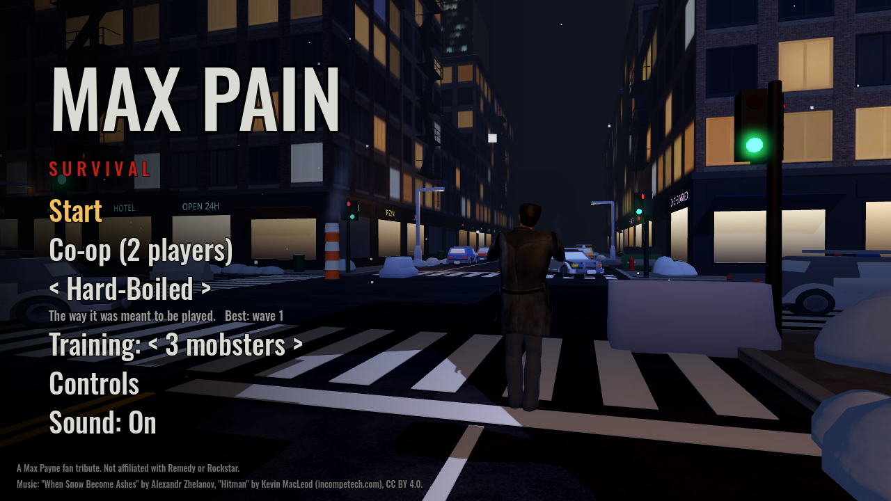
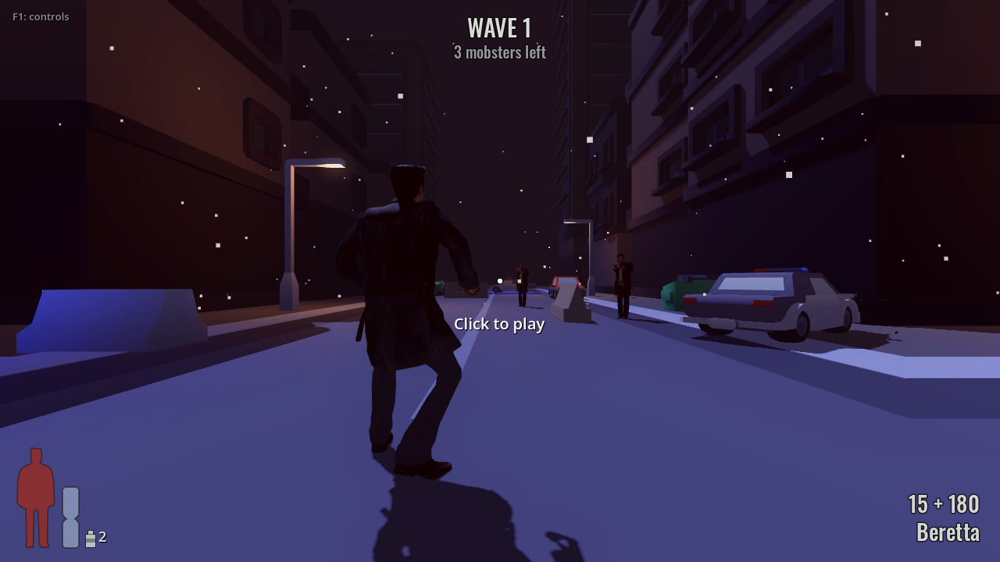
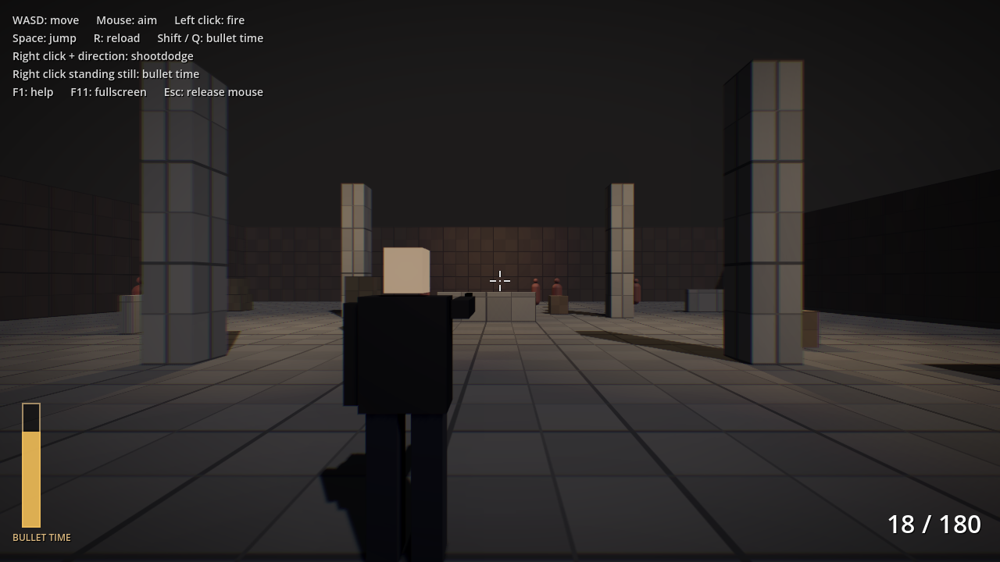
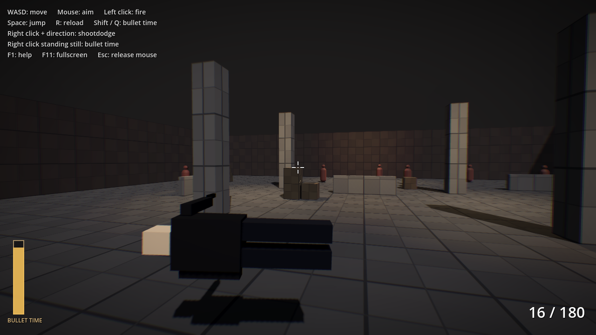

# Max Pain

A fan-made, Max Payne inspired third-person shooter built with
[Godot 4](https://godotengine.org) (GDScript): a **survival mode** on a snowy
New York street at night, where waves of mobsters come for Max and he fights
back with bullet time, **shootdodges** and cover.

### ▶ [Play in your browser](https://vidalmatheus.github.io/maxPain/)

Works on desktop and on phones (hold the phone in landscape). To build it
for Windows, Linux or macOS, see [Exporting builds](#exporting-builds-windows-linux-macos-web).

| Title | Survival |
|---|---|
|  |  |
| **Bullet time** | **Shootdodge** |
|  |  |

> Max Payne is a trademark of Remedy Entertainment / Rockstar Games. This is a
> non-commercial fan project. The character model comes from Sketchfab and the
> animations are CC0; see [Credits](#credits).

## Features

- **Survival mode**: waves of mobsters come in from the ends of the streets.
  Each wave brings two more than the last, and the next one starts 15 seconds
  after the last mobster of a wave dies. Dead mobsters drop ammo, and
  sometimes adrenaline (bullet time) or painkillers; painkiller bottles also
  turn up at random spots on the street. The best wave per
  difficulty is saved.
- **Mobsters that shoot back**: they run along a navigation mesh until they
  see Max, then fire in bursts with a reaction delay; hurt ones run for cover
  on the far side of a car or barrier, duck and pop up to shoot. A shootdodging
  Max is much harder to hit. Headshots deal triple damage.
- **Difficulty levels** named after the original's: *Fugitive*, *Hard-Boiled*
  and *Dead on Arrival* (enemy health, damage, accuracy, reaction time, wave
  size and drops).
- **Cover**: stick to walls, cars and concrete barriers; crouch behind low
  cover, pop up to shoot and slide along it. Max can also jump onto cars,
  barriers and dumpsters.
- **Health and painkillers**: the HUD silhouette fills with red as Max gets
  hurt; painkillers heal over a moment, like in the original.
- **The street**: a snowy New York intersection at night: wet asphalt with
  painted lines and zebra crosswalks, concrete sidewalks with granite curbs,
  brick tenements with lit windows, shops with neon signs and awnings, fire
  escapes and water towers, working traffic lights, hydrants, steaming
  manholes and a Con Ed stack, plowed snow along the curbs and on the cars,
  parked cars, police cars with flashing lights, street lamps, dumpsters and
  concrete barriers. Built in code from Kenney's car and road kits and
  ambientCG textures.
- **Title screen** with music, difficulty selection, a training range (mobsters
  that shoot back and keep coming back), the controls and a sound on/off option (also in the
  pause menu, remembered between visits); a pause menu and a game over screen.
- **Animated Max Payne** model with Max Payne 3 style upper/lower body
  blending: the legs run in the movement direction (forwards or backwards)
  while the spine twists so the upper body always faces the aim. Arm IK keeps
  the guns exactly on the aim line: a two-handed grip with one Beretta (the
  left hand cupping the right), arms straight out with two, the fingers
  closed around the grips and the head looking at the target.
- **Third-person controller**: over-the-shoulder camera, the character always
  faces the aim direction and strafes/backpedals while shooting.
- **Bullet time**: eases the world to 30% speed while mouse aiming stays fully
  responsive. Adrenaline drains in real time and is refilled by kills. A
  full-screen effect (warm desaturation, vignette, chromatic aberration) fades
  in with the slowdown, and a "time freeze" hit and a droning clock play
  while the world's sounds slow down, drop in pitch and get muffled.
- **Berettas**: a single Beretta 92FS (15 rounds, held two-handed) or **dual
  Berettas** (30 rounds, one in each hand at arm's length, firing
  alternately). Recoil, muzzle flash, spent casings ejected to the right that
  bounce on the floor, and a reload where the empty magazine drops out with
  physics. Bullets are **physical projectiles** (not hitscan),
  so you can watch them fly in slow motion. They knock props around.
  Hold the trigger to keep firing at a steady cadence.
- **Pistol-whip**: up close, Max raises the gun and brings the butt down on
  the mobster in front of him, knocking him back and stopping him from
  shooting for a moment.
- **Sound effects**: positional gunshots, brass casings clinking on every
  bounce, magazines hitting the floor, a three-part reload (magazine out,
  magazine in, slide when it was empty), dry fire and weapon switching.
- **Shootdodge**: dive in any direction in slow motion, keep shooting while
  airborne, land on the ground (you can still shoot while prone) and get back
  up. The body stretches out head first and follows the arc of the jump,
  rolling so the chest faces the aim: face down diving forward, on the side
  diving sideways, and on the back diving backwards, curled up to shoot over
  the feet.
- **Max Payne 1 style HUD**: a health silhouette and a bullet-time hourglass
  (the sand is your adrenaline) at the bottom left, rounds as "magazine +
  reserve" and the weapon name at the bottom right, and a dot crosshair.
- **Phones and tablets**: on-screen controls in the browser (or a native
  mobile build), fullscreen landscape on the first touch, and a "rotate your
  device" hint when held upright.
- **Training range**: mobsters at the far end shoot back at the difficulty
  picked on the title screen, and each one comes back at its spot 5 seconds
  after it dies. If Max dies, the range starts over.

## Controls

Keyboard/mouse and controllers (Xbox, PlayStation 5 DualSense, PlayStation 4
DualShock and other standard gamepads) are supported on desktop and in the
browser. The controller layout follows Max Payne 3, and the on-screen prompts
switch automatically to the device you are using.

| Action | Keyboard / mouse | Xbox | PlayStation |
|---|---|---|---|
| Move | WASD / arrows | Left stick | Left stick |
| Aim | Mouse | Right stick | Right stick |
| Fire (hold for automatic fire) | Left click | RT | R2 |
| Aim (zoom in, hold) | Z | LT | L2 |
| Shootdodge (with a direction) | Right click or Shift | R3 (click) | R3 (click) |
| Bullet time (toggle) | Q (or right click / Shift standing still) | R3 standing still (or LB) | R3 standing still (or L1) |
| Pistol-whip | V, F or middle click | RB | R1 |
| Jump | Space | A | Cross |
| Reload | R | X | Square |
| Beretta / dual Berettas | 1 / 2 / mouse wheel | Y / D-pad left/right | Triangle / D-pad left/right |
| Take cover / leave cover | C or Ctrl | B | Circle |
| Painkiller | Tab (or H / E) | D-pad up | D-pad up |
| Pause | Esc or P | Menu | Options |
| Help | F1 | View | Create |
| Fullscreen | F11 | | |

The shootdodge button while standing still toggles bullet time, like in the
original game.

On phones and tablets the touch controls appear automatically: a floating
joystick on the left half of the screen to move, drag anywhere on the right
half to aim, and buttons for FIRE, DODGE (shootdodge with the joystick held in
a direction), SLOW (bullet time), JUMP, RELOAD, GUN (one or two Berettas),
COVER, PILL (painkiller) and WHIP (pistol-whip), plus II at the top right to
pause. Holding FIRE keeps firing.
The game goes fullscreen in landscape on the first touch; on iPhones, which
don't allow locking the orientation from the browser, just rotate the phone.

Controller extras:

- **Rumble** when firing and when landing a shootdodge.
- **Analog aiming** with a response curve for fine adjustments, a turn boost
  when holding the stick at the edge, and light aim friction while the
  crosshair is over an enemy.
- In the browser, press any controller button once so the page detects it.

## Running the project

1. Download **Godot 4.7** (standard version, not .NET) from
   <https://godotengine.org/download>. It runs on macOS, Windows and Linux.
2. Open Godot, click **Import** and select this folder's `project.godot`.
3. Press **F5** to play.

## Exporting builds (Windows, Linux, macOS, Web)

Export presets for all four platforms are already configured in
`export_presets.cfg`.

1. In the editor: **Editor > Manage Export Templates > Download and Install**.
2. **Project > Export...**, pick a preset and click **Export Project**. Builds
   are written to `build/<platform>/`.

Or from the command line:

```sh
godot --headless --export-release "Windows" build/windows/MaxPain.exe
godot --headless --export-release "Linux"   build/linux/MaxPain.x86_64
godot --headless --export-release "macOS"   build/macos/MaxPain.zip
godot --headless --export-release "Web"     build/web/index.html
```

Notes:

- The project uses the **Compatibility** renderer (OpenGL 3.3 / WebGL 2) so it
  looks the same everywhere, including the browser and older hardware.
- The macOS build is ad-hoc signed, not notarized. Players need to right-click
  the app and choose **Open** the first time.
- The Web build is single-threaded, so it needs no special server headers and
  can be uploaded as-is to itch.io or GitHub Pages. To test it locally, serve
  the folder over HTTP (for example `python3 -m http.server -d build/web`)
  instead of opening the file directly.

## Play online, PR previews and releases

The Web build is published to GitHub Pages and the desktop builds to GitHub
Releases, all by GitHub Actions:

| Workflow | When | What |
|---|---|---|
| `pages.yml` | push to `main` | Smoke test, then publishes the game at `https://vidalmatheus.github.io/maxPain/` |
| `pr-preview.yml` | every pull request | Playable preview at `https://vidalmatheus.github.io/maxPain/pr-preview/pr-<number>/` (the link is posted on the PR), with screenshots of the core mechanics in `.../shots/`. Removed when the PR is closed. |
| `release.yml` | tags like `v0.1.0` | GitHub Release with the Windows, Linux and macOS builds attached |

To publish a release:

```sh
git tag v0.1.0 && git push origin v0.1.0
```

One-time setup: GitHub Pages must be set to **Settings > Pages > Source:
Deploy from a branch > `gh-pages` / (root)**, so the main site and the PR
previews (in `gh-pages/pr-preview/`) live side by side. The `gh-pages` branch
is created by the first workflow run. On the free plan the repository must be
public.

To build locally (export templates required), use `tools/export.sh`:

```sh
tools/export.sh web          # or: windows linux macos, or: all
python3 -m http.server -d build/web
```

## Tests

A headless smoke test drives the training range and checks walking,
shooting (and that the pistol points at the crosshair), kills, bullet time,
shootdodge, reloading, sounds and the touch controls; then a survival game
(waves, mobsters shooting Max, drops and pickups, painkillers, cover, death)
and the title screen. It exits with code 0 when every check passes:

```sh
godot --headless --path . res://tests/smoke_test.tscn
```

A second scene plays a scripted sequence and saves screenshots plus an
`index.html` gallery (it needs a renderer, so no `--headless`; CI runs it under
`xvfb-run`):

```sh
godot --path . res://tests/screenshots.tscn -- --output=/tmp/shots
```

To review the character's poses, `tests/pose_gallery.tscn` freezes Max in
each stance, run direction and shootdodge direction and saves screenshots
from the game camera and from outside (add `--only=stand` for just the
standing stances and close-ups of the hands):

```sh
godot --path . res://tests/pose_gallery.tscn -- --output=/tmp/poses
```

## Character pipeline

The character model has no skeleton, so `tools/build_character.gd` rigs it
without Blender: it scales Quaternius' humanoid skeleton to Max, bends the
arms and legs onto the mesh and weights each vertex to the nearest bones of its
body part (the hands to the finger joints too, so they can close around a
grip). It also extracts the animations the game uses. See
[assets/characters/max_payne/README.md](assets/characters/max_payne/README.md).

```sh
godot --headless --path . --import
godot --headless --path . -s tools/build_character.gd -- --source=<animation packs dir>
```

## Project layout

```
autoload/
  bullet_time.gd       Global slow-motion controller and adrenaline meter
  game.gd              Difficulty, scene changes, saved best waves
  game_input.gd        Default input bindings (keyboard, mouse, gamepad)
  music.gd             Background music with crossfades
  sound_fx.gd          Sound effects and the bullet-time soundscape
scenes/
  title/               Title screen (the main scene)
  game/                Survival mode: waves of enemies
  levels/              The street at night (built in code), snow, police lights
  enemies/             Mobster AI
  pickups/             Ammo, adrenaline and painkillers dropped by enemies
  main.tscn            Training range
  training/            Training range mobsters that keep coming back
  player/              Player controller, camera and animated character model
  weapons/             Pistol and bullet
  targets/             Practice target dummy (used by the tests)
  props/               Physics crate
  fx/                  Impact particles
  ui/                  HUD, crosshair, bullet-time shader, menus
tests/                 Headless smoke test and screenshot sequence
assets/characters/     Character model, rig and animations (see its README)
assets/weapons/        Weapon models (see their READMEs)
assets/fonts/          HUD font and its license
assets/sounds/         Sound effects (CC0, see its README)
assets/music/          Music (CC BY 4.0, see its README)
assets/environment/    Cars, lamps and street props (CC0, see its README)
assets/textures/street/  Asphalt, sidewalk, facade and snow textures (CC0, see its README)
tools/export.sh        Exports builds into build/<platform>/
tools/build_character.gd  Rigs the character and extracts its animations
tools/prepare_sounds.sh   Cuts the sound effects out of their source packs
tools/prepare_music.sh    Converts the music (and its short loops for the web)
tools/prepare_textures.py Builds the street textures (lit windows, sidewalk joints)
.github/               CI: Pages deploy, PR previews, releases
```

Physics layers: `1 world`, `2 player`, `3 enemies`, `4 props`.

## Roadmap

- [x] Character movement, camera and aiming
- [x] Bullet time with adrenaline
- [x] Pistol with physical bullets
- [x] Shootdodge
- [x] Animated character model
- [x] Sound effects
- [x] Music
- [x] Enemy AI that shoots back, player health and painkillers
- [x] Survival mode with waves, difficulty levels and a title screen
- [x] Cover
- [x] Dual Berettas
- [ ] More weapons (shotgun, Desert Eagle, Ingram, ...)
- [ ] Bullet cam on the last kill
- [ ] First level and graphic-novel style cutscenes
- [x] CI that publishes builds for every platform

## Credits

- **Max Payne model:** "Max Payne 1" by
  [BimboCattibo90](https://sketchfab.com/stefanocagnani1990) on
  [Sketchfab](https://sketchfab.com/3d-models/max-payne-1-b6ffa273ad774c66a2ff202d85f58e94),
  CC BY 4.0. The character is owned by Remedy Entertainment / Rockstar Games.
- **HUD font:** [Oswald](https://fonts.google.com/specimen/Oswald) by the
  Oswald Project Authors, SIL Open Font License 1.1.
- **Beretta model:** "Beretta M9" by
  [emran.bayati](https://sketchfab.com/emran.bayati) on
  [Sketchfab](https://sketchfab.com/3d-models/beretta-m9-d1200d9aa28f466484f7d3fdd7724e76),
  CC BY 4.0.
- **Animations:** Universal Animation Library 1 and 2 by
  [Quaternius](https://quaternius.com), CC0.
- **Sounds:** [Kenney](https://kenney.nl), The Free Firearm Sound Library
  (Ben Jaszczak et al.), SpringySpringo and MidFag on
  [OpenGameArt](https://opengameart.org), all CC0; see
  [assets/sounds/README.md](assets/sounds/README.md).
- **Music:** "When Snow Become Ashes" by
  [Alexandr Zhelanov](https://opengameart.org/content/when-snow-become-ashes)
  and "Hitman" by Kevin MacLeod ([incompetech.com](https://incompetech.com)),
  licensed under [Creative Commons: By Attribution 4.0](https://creativecommons.org/licenses/by/4.0/).
- **Cars and street props:** Car Kit and City Kit (Roads) by
  [Kenney](https://kenney.nl), CC0; see
  [assets/environment/README.md](assets/environment/README.md).
- **Street textures:** asphalt, concrete, brick facades and snow from
  [ambientCG](https://ambientcg.com), CC0; see
  [assets/textures/street/README.md](assets/textures/street/README.md).
- **Enemies** reuse the Max model with recolored clothes.
